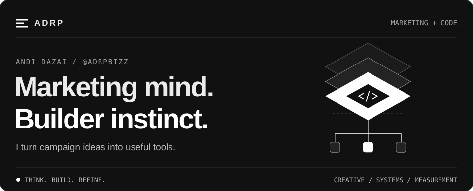

<picture>
  <source media="(max-width: 600px)" srcset="assets/hero-mobile.svg">
  
</picture>

  <a href="#selected-work">Selected work</a> &nbsp; / &nbsp;
  <a href="#toolbox">Toolbox</a> &nbsp; / &nbsp;
  <a href="https://github.com/adrpbizz?tab=repositories">Explore repositories →</a>

# Hey, I'm Andi.

I build tools where **marketing, creative work, and code** meet: turning campaign briefs into assets, making creative production repeatable, and making metrics easier to use.

**My focus:** less repetitive work, clearer decisions, and things people can actually use.

## Selected work

<table width="100%">
<tr><td width="960">
01 / CREATIVE AUTOMATION
<h3><a href="https://github.com/adrpbizz/programmatic-creative-pipeline">Programmatic Creative Pipeline →</a></h3>

<b>One layout. A whole set of creatives.</b> Turn JSON layouts and CSV copy into PNG assets, resolved layout specs, and editable PowerPoint exports.

<code>Python</code> <code>Pillow</code> <code>python-pptx</code>

</td></tr>
</table>

<table width="100%">
<tr><td width="960">
02 / CAMPAIGN SYSTEMS
<h3><a href="https://github.com/adrpbizz/funnel-asset-kit">Funnel Asset Kit →</a></h3>

<b>From campaign brief to funnel-ready assets.</b> Generate ad variants, organic captions, UTM links, and relevant KPIs, organized by funnel stage.

<code>Python</code> <code>Flask</code> <code>Claude API</code> <code>HTML / CSS / JS</code>

</td></tr>
</table>

<table width="100%">
<tr><td width="960">
03 / MARKETING MEASUREMENT
<h3><a href="https://github.com/adrpbizz/marketing-metrics-cheatsheet">Marketing Metrics Cheat Sheet →</a></h3>

<b>Know what to measure. Know when it misleads.</b> A practical reference for marketing metrics, formulas, attribution traps, and campaign diagnostics.

<code>Analytics</code> <code>Funnel strategy</code> <code>Markdown</code>

</td></tr>
</table>

## Toolbox

**Build** &nbsp; `Python` · `Flask` · `JavaScript` · `HTML` · `CSS`  
**Create** &nbsp; `Pillow` · `python-pptx` · `JSON` · `CSV`  
**Connect** &nbsp; `Claude API` · `Relay.app` · `UTM tracking`  
**Measure** &nbsp; Campaign KPIs · Funnel strategy · Attribution

<b>How I approach a project</b>

1. **Start with the job.** Find the repetitive task or unclear decision.
2. **Build the useful part.** Turn it into a tool, template, or reference.
3. **Make it inspectable.** Keep the inputs, outputs, and limitations clear.
4. **Refine from use.** Improve the parts that matter in practice.

---

  <b>Have an idea for one of these tools?</b> 
  <a href="https://github.com/adrpbizz/programmatic-creative-pipeline/issues">Creative pipeline</a> &nbsp; · &nbsp;
  <a href="https://github.com/adrpbizz/funnel-asset-kit/issues">Funnel kit</a> &nbsp; · &nbsp;
  <a href="https://github.com/adrpbizz/marketing-metrics-cheatsheet/issues">Metrics guide</a>

Think clearly. Build useful things. Keep improving.

